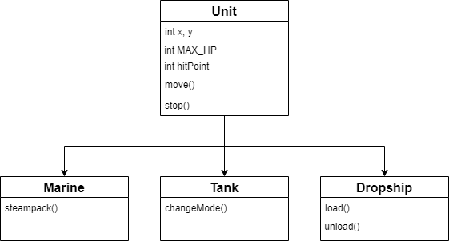
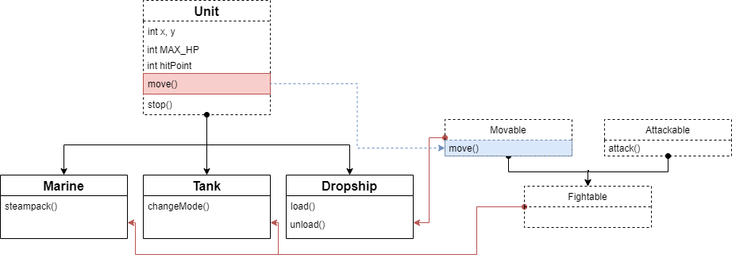
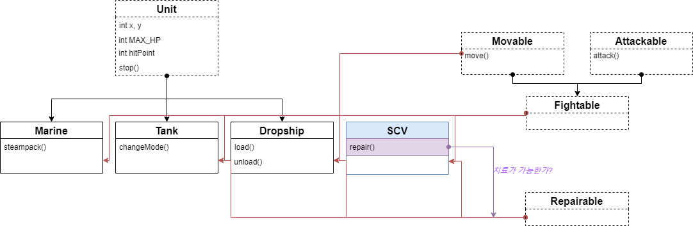

# 주어진 자료

- Marine, Tank, Dropship 유닛 사용
- 위치를 나타내는 좌표값 x, y
- 최대 체력 MAX_HP
- 현재 체력 hitPoint
- 이동 move()
- 정지 stop()
- 마린 : 스팀팩, 탱크 : 시즈모드, 드랍쉽 : 타기/내리기 

# 부모 Class(Unit)로 추상화하기



###### 상속은 수직적 관계를 정의하기에 좋다.

marine, tank, dropship이 공통으로 보유하고 있는 좌표값, 체력, 이동, 정지 부분을 Unit이라는 상위 Class로 뽑아냅니다. 
자식 Class에서의 move() 메소드는 서로 다른 로직을 가질 수 있으므로 (속도, 가속도 등으로 인하여) 추상 메소드로 만들고, 그에 따라 Unit Class도 추상 클래스가 됩니다.

```java
//Unit.java
package starcraft;

public abstract class Unit {
	int x, y;				// 위치값 x, y
	final int MAX_HP;		// 최대체력, 초기화 후 변하면 안되는 값이므로 final으로 선언
    int hitPoint;			// 현재체력
	abstract void move();	// 이동 move() - 추상메소드 
	void stop() { }			// 정지 stop()
}


```
Unit.java에서 정의한 Unit Class입니다. 추상 클래스이며, 
move()메소드도 추상 메소드인 것을 확인할 수 있습니다.


```java
//Marine.java
package starcraft;

public class Marine extends Unit{
    //Unit에게서 상속받은 move() 메소드 Override
    @Override
    public void move(int x, int y) {
        System.out.printf("[%s,%s] Marine Move!!%n", x, y);
    }
    //Object에게서 상속받은 toString() 메소드 Override
    @Override
    public String toString() {
        return "Marine";
    }
    //Marine 개인이 보유한 메소드
    void steampack() { }
}
```
```java
//Tank.java
package starcraft;

public class Tank extends Unit{
    //Unit에게서 상속받은 move() 메소드 Override
    @Override
    public void move(int x, int y) {
        System.out.printf("[%s,%s] Tank Move!!%n", x, y);
    }
    //Object에게서 상속받은 toString() 메소드 Override 
    @Override
    public String toString() {
        return "Tank";
    }
    //Tank 개인이 보유한 메소드
    void changeMode() { }
}
```
```java
//Dropship.java
package starcraft;

public class Dropship extends Unit{
    //Unit에게서 상속받은 move() 메소드 Override
    @Override
    public void move(int x, int y) {
        System.out.printf("[%s,%s] Dropship Move!!%n", x, y);
    }
    //Object에게서 상속받은 toString() 메소드 Override 
    @Override
    public String toString() {
        return "Dropship";
    }
    //Dropship 개인이 보유한 메소드 
    void load() { }
    void unload() { }
}
```
세 클래스가 모두 같은 내용이므로 Marine 기준으로 설명합니다.

처음에 Marine Class 파일을 생성하여 Unit Class를 상속받았을 때, Marine 클래스에서 오류가 발생합니다. 그 이유는, Unit Class는 추상클래스이기 때문에 Marine 클래스에서 추상 메소드를 구현해줘야 하기 때문입니다. 
eclipse 기준으로 'class Marine'위치에 커서를 위치한 후  팝업창의 Add unimplemented method를 클릭하시면 바로 구현에 필요한 구문을 작성해 줍니다.

# Interface 추가(공격, 이동)




###### Interface는 수평적 관계를 정의하기에 좋다.

###### Interface는 다중 상속이 가능하다.

3개의 유닛이 가지고 있는 특성에 따라 Movable, Attackable Interface를 구현하여 그 안에 move()와 attack() 메소드를 정의합니다. 이에 따라 Unit Class에 있는 move() 메소드는 더 이상 존재할 이유가 없으므로 제거해도 됩니다. 

대부분의 유닛은 이동도 가능하며 공격할 수 있으므로, Fightable Interface를 생성하여 Movable과 Attackable Interface를 상속받습니다.

구현된 Fightable은 Marine과 Tank Class에, Movable은 Dropship Class에(드랍쉽은 공격할 수 없으므로) implement 됩니다.


# Interface 추가(수리 가능한)



###### Class는 다수의 Interface를 implements하여 내용을 구현할 수 있다.

